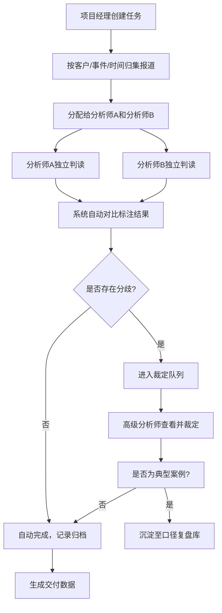

## 1. 产品概述

舆情协同标注工作台是面向舆情服务商分析师团队的专业级协同工具，通过标准化流程帮助多人对媒体报道倾向形成一致口径，解决因个人经验差异导致的报告口径不一致问题。

- 主要用途：媒体报道倾向标注、双人交叉校验、高级分析师裁定、典型案例沉淀
- 解决问题：避免舆情报告因个人经验差异出现前后口径不一，提升交付稳定性
- 目标用户：项目经理、舆情分析师、高级分析师
- 产品价值：标准化标注流程 → 降低人为偏差 → 提升交付质量 → 增强客户信任

## 2. 核心功能

### 2.1 用户角色

| 角色 | 描述 | 核心权限 |
|------|------|----------|
| 项目经理 | 客户对接人、任务统筹者 | 创建任务、按客户/事件/时间段管理、分配报道给分析师、查看整体进度 |
| 分析师 | 一线标注执行者 | 接收任务、对报道进行双人判读、填写倾向/理由/风险/建议 |
| 高级分析师 | 质量把控者、口径裁定者 | 裁定分歧、审核标注结果、维护口径复盘库 |

### 2.2 功能模块

1. **任务分派页**：客户管理、事件创建、时间筛选、报道列表、批量分配、进度看板
2. **双人判读页**：报道详情展示（标题/正文/媒体属性/转载关系/历史报道）、双人标注表单、自动分歧检测、裁定流程
3. **口径复盘页**：典型样本库、敏感词/解读规则、消息源立场档案、检索过滤、案例详情

### 2.3 页面详情

| 页面名称 | 模块名称 | 功能描述 |
|----------|----------|----------|
| 任务分派 | 顶部筛选栏 | 客户下拉选择、事件多选、日期范围选择、状态筛选、搜索框 |
| 任务分派 | 客户/事件管理区 | 新建客户、新建事件、事件标签体系、客户事件关联展示 |
| 任务分派 | 报道列表区 | 报道卡片（标题/媒体/发布时间/转载数/当前状态/分配情况）、批量勾选、批量分配弹窗 |
| 任务分派 | 分配弹窗 | 分析师下拉选择（双人）、预估完成时间、备注说明 |
| 任务分派 | 进度看板 | 待分配/标注中/分歧待裁定/已完成 四象限看板、任务统计数字 |
| 双人判读 | 报道信息卡 | 标题（大字号）、发布媒体+属性标签（央媒/市场化/自媒体/境外）、发布时间、原文链接 |
| 双人判读 | 正文阅读区 | 正文内容、关键词高亮、可折叠段落、转载关系图谱（可交互）、历史报道时间线 |
| 双人判读 | 左侧分析师A标注区 | 倾向类别（正面/中性/负面/严重负面）、判断理由（多行文本+快捷标签）、风险等级（1-5级）、建议摘要 |
| 双人判读 | 右侧分析师B标注区 | 同上，与左侧并排展示便于对比 |
| 双人判读 | 分歧检测区 | 自动对比两人标注结果、高亮分歧项（如倾向不一致/风险等级差异>2级）、分歧原因提示 |
| 双人判读 | 裁定区（高级分析师可见） | 裁定选项（采信A/采信B/重新标注）、裁定意见、定稿按钮 |
| 口径复盘 | 顶部筛选 | 倾向类别筛选、风险等级筛选、媒体属性筛选、关键词搜索、时间范围 |
| 口径复盘 | 典型样本卡片列表 | 缩略信息（标题/倾向/风险等级/典型原因标签）、点击展开详情 |
| 口径复盘 | 样本详情抽屉 | 完整报道内容、两次标注对比、裁定意见、典型性说明 |
| 口径复盘 | 解读规则库 | 词语/短语列表、规则说明（不应过度解读/需特别关注）、添加/编辑规则 |
| 口径复盘 | 消息源档案 | 媒体/自媒体账号、立场倾向（强烈支持/温和支持/中立/温和反对/强烈反对）、历史记录、可信度评分 |

## 3. 核心流程

### 3.1 完整工作流程

项目经理创建任务并按客户/事件/时间范围归集报道 → 将每条报道分配给两名不同的分析师 → 两名分析师各自独立完成判读（倾向+理由+风险+建议）→ 系统自动检测标注分歧 → 若无分歧则自动完成；若有分歧则进入裁定队列 → 高级分析师查看分歧点并作出最终裁定 → 典型案例被沉淀至口径复盘库 → 新的标注任务可引用复盘库中的历史案例作为参考。

### 3.2 双人判读分歧判定规则

- 倾向类别不一致 → 一级分歧（必须裁定）
- 风险等级差异 ≥ 2级 → 二级分歧（必须裁定）
- 风险等级差异 = 1级 → 三级分歧（提示关注，可选裁定）
- 判断理由关键词重合度 < 40% → 提示性分歧（建议沟通）

## 4. 用户界面设计

### 4.1 设计风格

- **设计定位**：专业、克制、高效的企业级工作台，强调信息密度和可读性，避免花哨装饰
- **主色调**：深蓝灰 `#1E293B` 作为导航和标题区主色，传达专业可靠感
- **辅助色**：
  - 正面倾向：翡翠绿 `#059669`
  - 中性倾向：石板灰 `#64748B`
  - 负面倾向：琥珀橙 `#D97706`
  - 严重负面：赤红 `#DC2626`
  - 分歧警示：紫罗兰 `#7C3AED`
  - 裁定通过：靛蓝 `#2563EB`
- **背景色**：主背景 `#F8FAFC`（浅蓝灰），卡片纯白 `#FFFFFF`，分区线 `#E2E8F0`
- **字体**：标题使用思源宋体（庄重感），正文使用思源黑体（可读性强）；备选 Noto Serif SC + Noto Sans SC
- **按钮样式**：圆角4px，主按钮深蓝填充+白字，次按钮浅灰描边+深字；悬停有微妙阴影提升
- **布局风格**：顶部导航 + 三栏布局（左侧筛选/目录、中间主内容、右侧详情/抽屉）；卡片式分区，清晰的视觉层级
- **图标风格**：线性图标（stroke 1.5px），统一风格；不使用emoji，保持专业调性

### 4.2 页面设计概述

| 页面名称 | 模块名称 | UI元素要点 |
|----------|----------|------------|
| 任务分派 | 整体布局 | 顶部客户/事件筛选条（深蓝底）+ 左侧事件树 + 中间报道列表 + 右侧统计面板 |
| 任务分派 | 报道卡片 | 悬停时左侧出现2px靛蓝竖条标识选中；状态用胶囊标签；转载数用小图标+数字 |
| 任务分派 | 进度看板 | 四象限卡片，每卡片顶部有大号数字，下方迷你进度条，底部列表展示最近5条 |
| 双人判读 | 整体布局 | 顶部报道标题条 + 左中右三栏（A标注 / 报道正文 / B标注）+ 底部分歧裁定条 |
| 双人判读 | 正文区 | 关键词用背景色高亮（正面临时浅绿、负面临时浅红）；鼠标悬停段落显示"标注此段"按钮 |
| 双人判读 | 分歧提示 | 两人结果对不上时，对应行背景变浅紫，右侧出现紫色⚠图标；点击可展开具体差异说明 |
| 双人判读 | 裁定条 | 固定底部，深紫渐变背景，大号裁定按钮，裁定意见输入框展开式 |
| 口径复盘 | 整体布局 | 左侧规则库/消息源切换标签 + 中间样本卡片瀑布流 + 右侧样本详情抽屉 |
| 口径复盘 | 样本卡片 | 倾斜角度1°的微错位卡片群，每张卡片底部有彩色渐变条代表风险等级 |
| 口径复盘 | 规则库 | 词语标签云（不应解读用灰、需关注用橙红），hover放大1.05倍并显示规则详情tooltip |

### 4.3 响应式设计

- 桌面优先（1440×900基准），支持1280~1920宽度自适应
- 1280以下：双人判读页改为上下布局（A区在上、正文在中、B区在下）
- 平板端（1024）：隐藏次要面板，增加折叠按钮
- 不做移动端适配（纯工作台场景，PC端使用）

### 4.4 微交互与动效

- 页面加载：卡片交错渐入（stagger 60ms，translateY 12px → 0）
- 分歧检测：出现时用脉冲动画（scale 1 → 1.03 → 1，紫色阴影闪烁一次）
- 裁定通过：完成勾选图标的SVG描边动画（draw effect 600ms）
- 卡片悬停：box-shadow 从0 1px 2px → 0 8px 24px -8px，过渡240ms ease-out
