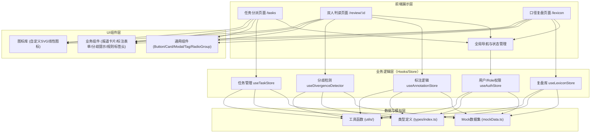

## 1. 架构设计



## 2. 技术选型

- **前端框架**：React@18 + TypeScript@5
- **构建工具**：Vite@5
- **样式方案**：TailwindCSS@3（原子化CSS）+ 少量CSS变量定义主题
- **状态管理**：Zustand@4（轻量级，减少Redux模板代码）
- **路由**：React Router@6（createBrowserRouter）
- **图标**：自研SVG线性图标组件集（避免引入重量级图标库）
- **动效**：Framer Motion@11（分歧脉冲、卡片交错渐入等动画）
- **图表/可视化**：原生SVG手写转载关系图谱和时间线（无需引入D3/ECharts）
- **后端**：无后端，纯前端Mock数据驱动（所有数据存放于mockData.ts，通过Zustand Store模拟增删改查）

### 第三方库清单
| 库名称 | 版本 | 用途 |
|--------|------|------|
| react | 18.3.1 | 核心框架 |
| react-dom | 18.3.1 | DOM渲染 |
| react-router-dom | 6.26.0 | 路由管理 |
| zustand | 4.5.4 | 状态管理 |
| framer-motion | 11.3.19 | 动画与微交互 |
| clsx | 2.1.1 | 条件类名拼接 |
| tailwindcss | 3.4.7 | 原子化样式 |
| @tailwindcss/forms | 0.5.7 | 表单样式重置 |
| typescript | 5.5.3 | 类型系统 |
| vite | 5.3.5 | 构建开发 |

## 3. 路由定义

| 路由路径 | 页面组件 | 访问角色 | 说明 |
|----------|----------|----------|------|
| `/` | Redirect → `/tasks` | 全部 | 根路径重定向 |
| `/tasks` | TaskDispatchPage | 项目经理/高级分析师 | 任务分派主页 |
| `/review/:articleId` | DualReviewPage | 分析师/高级分析师 | 双人判读页，带报道ID参数 |
| `/lexicon` | LexiconReviewPage | 全部角色 | 口径复盘库 |
| `*` | NotFoundPage | 全部 | 404兜底页 |

## 4. 数据类型定义

```typescript
// ========== 基础枚举 ==========
export type SentimentType = 'positive' | 'neutral' | 'negative' | 'severe_negative';
export type RiskLevel = 1 | 2 | 3 | 4 | 5;
export type MediaProperty = 'central' | 'market' | 'selfmedia' | 'overseas';
export type TaskStatus = 'pending' | 'annotating' | 'divergent' | 'completed';
export type UserRole = 'project_manager' | 'analyst' | 'senior_analyst';
export type SourceStance = 'strong_support' | 'mild_support' | 'neutral' | 'mild_oppose' | 'strong_oppose';
export type DivergenceLevel = 'critical' | 'warning' | 'notice';
export type RulingDecision = 'accept_a' | 'accept_b' | 'reannotate';

// ========== 用户 ==========
export interface User {
  id: string;
  name: string;
  avatar: string;
  role: UserRole;
  workload: number; // 当前进行中的标注数
}

// ========== 客户与事件 ==========
export interface Client {
  id: string;
  name: string;
  logo?: string;
  industry: string;
}

export interface Event {
  id: string;
  clientId: string;
  name: string;
  tags: string[];
  startTime: string;
  endTime: string;
}

// ========== 报道 ==========
export interface RepostRelation {
  sourceId: string;
  sourceTitle: string;
  sourceMedia: string;
  repostTime: string;
}

export interface HistoryArticle {
  id: string;
  title: string;
  publishTime: string;
  media: string;
  sentiment: SentimentType;
}

export interface Article {
  id: string;
  eventId: string;
  clientId: string;
  title: string;
  content: string;
  mediaName: string;
  mediaProperty: MediaProperty;
  publishTime: string;
  repostCount: number;
  repostRelations: RepostRelation[];
  historyArticles: HistoryArticle[];
  keywords: string[];
  originalUrl?: string;
  status: TaskStatus;
  assigneeA?: string;
  assigneeB?: string;
  assignedAt?: string;
}

// ========== 标注结果 ==========
export interface Annotation {
  id: string;
  articleId: string;
  userId: string;
  sentiment: SentimentType;
  reason: string;
  reasonTags: string[];
  riskLevel: RiskLevel;
  suggestion: string;
  annotatedAt: string;
}

// ========== 分歧检测 ==========
export interface DivergencePoint {
  field: 'sentiment' | 'riskLevel' | 'reason';
  level: DivergenceLevel;
  description: string;
  valueA: any;
  valueB: any;
}

export interface DivergenceResult {
  hasDivergence: boolean;
  points: DivergencePoint[];
  summary: string;
}

// ========== 裁定 ==========
export interface Ruling {
  id: string;
  articleId: string;
  seniorAnalystId: string;
  decision: RulingDecision;
  opinion: string;
  finalSentiment: SentimentType;
  finalRiskLevel: RiskLevel;
  ruledAt: string;
  isTypicalCase: boolean;
  typicalReason?: string;
}

// ========== 口径复盘库 ==========
export interface InterpretationRule {
  id: string;
  phrase: string;
  category: 'over_interpret' | 'need_attention';
  description: string;
  exampleContext: string;
  addedBy: string;
  addedAt: string;
  usageCount: number;
}

export interface MediaSourceProfile {
  id: string;
  name: string;
  property: MediaProperty;
  stance: SourceStance;
  credibility: number; // 0-100
  historicalNotes: string;
  sampleCount: number;
}

export interface TypicalCase {
  id: string;
  articleSnapshot: Article;
  annotationA: Annotation;
  annotationB: Annotation;
  ruling: Ruling;
  tags: string[];
  summary: string;
  archivedAt: string;
}
```

## 5. 项目目录结构

```
10068/
├── src/
│   ├── assets/              # 静态资源
│   │   └── icons/           # SVG图标
│   ├── components/          # 组件
│   │   ├── common/          # 通用组件 (Button, Card, Modal, Tag, RadioGroup, ProgressBar)
│   │   ├── layout/          # 布局组件 (AppShell, TopNav, SideNav)
│   │   ├── tasks/           # 任务分派相关组件
│   │   ├── review/          # 双人判读相关组件
│   │   └── lexicon/         # 口径复盘相关组件
│   ├── pages/               # 页面级组件
│   │   ├── TaskDispatchPage.tsx
│   │   ├── DualReviewPage.tsx
│   │   └── LexiconReviewPage.tsx
│   ├── store/               # Zustand Stores
│   │   ├── useAuthStore.ts
│   │   ├── useTaskStore.ts
│   │   ├── useAnnotationStore.ts
│   │   └── useLexiconStore.ts
│   ├── hooks/               # 自定义Hooks
│   │   ├── useDivergenceDetector.ts
│   │   └── useStaggeredReveal.ts
│   ├── data/                # Mock数据
│   │   └── mockData.ts
│   ├── types/               # 类型定义
│   │   └── index.ts
│   ├── utils/               # 工具函数
│   │   ├── sentiment.ts     # 倾向相关
│   │   ├── date.ts          # 日期格式化
│   │   └── divergence.ts    # 分歧检测算法
│   ├── styles/              # 全局样式
│   │   └── index.css        # Tailwind指令 + CSS变量
│   ├── router/              # 路由配置
│   │   └── index.tsx
│   ├── App.tsx
│   └── main.tsx
├── .trae/
│   └── documents/
├── index.html
├── package.json
├── vite.config.ts
├── tsconfig.json
├── tailwind.config.js
└── postcss.config.js
```

## 6. 核心模块说明

### 6.1 分歧检测算法（useDivergenceDetector）
输入：annotationA, annotationB → 输出：DivergenceResult
- sentiment 字段：直接比对枚举值，不等 → critical 级
- riskLevel 字段：abs(diff) ≥ 2 → critical；abs(diff) = 1 → warning
- reason 字段：对两段文本做分词（简单关键词匹配），计算Jaccard相似度，< 0.4 → notice 级

### 6.2 状态流设计
- 报道 Article.status 的流转：
  `pending`（创建时）→ 分配后 → `annotating` → 两人均完成标注且无分歧 → `completed`；有分歧 → `divergent` → 裁定完成 → `completed`

### 6.3 性能优化点
- 报道列表使用 React.memo + 虚拟列表（若数据量大则使用，当前版本100条以内直接渲染）
- 分歧检测结果 useMemo 缓存
- Zustand 使用 selector 避免不必要的重渲染（useShallow）
